# Gestor de Votos — Guia do Sistema

Plataforma web para gestão de campanhas políticas: cadastro de eleitores em tempo
real, organização por local de votação, gestão de lideranças (cabos eleitorais),
mapa de força, agenda de eventos e comunicação por WhatsApp — tudo isolado por
campanha (cada candidato vê apenas os próprios dados).

As telas abaixo são representações fiéis da interface, usadas para ilustrar cada
funcionalidade.

---

## Sumário

1. [Login e perfis de acesso](#1-login-e-perfis-de-acesso)
2. [Painel (Dashboard)](#2-painel-dashboard)
3. [Eleitores (Planilha)](#3-eleitores-planilha)
4. [Mapa de Força](#4-mapa-de-força)
5. [Agenda de Reuniões](#5-agenda-de-reuniões)
6. [Lideranças (Cabos eleitorais)](#6-lideranças-cabos-eleitorais)
7. [Cadastro público de eleitor](#7-cadastro-público-de-eleitor)
8. [Cadastro público de liderança](#8-cadastro-público-de-liderança)
9. [Campanhas (multi-candidato)](#9-campanhas-multi-candidato)
10. [Usuários](#10-usuários)
11. [Auditoria (LGPD)](#11-auditoria-lgpd)
12. [Central WhatsApp Automático](#12-central-whatsapp-automático)

---

## 1. Login e perfis de acesso

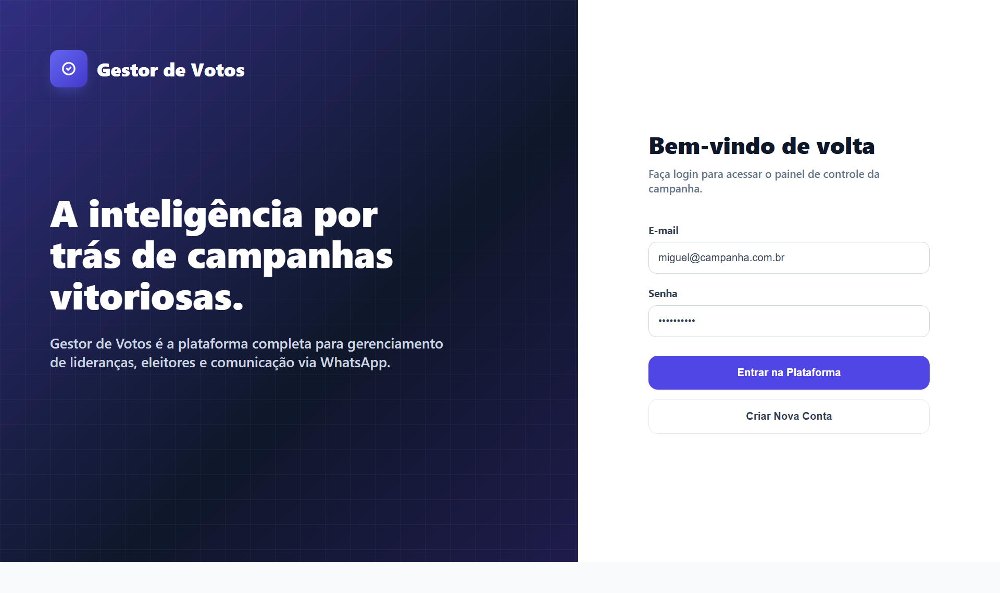

Porta de entrada da plataforma. O acesso é feito com **e-mail e senha**, validados
no servidor com token JWT e senhas criptografadas. Há também a opção de **criar
nova conta**. Como o backend roda em plano gratuito, na primeira tentativa do dia
o sistema avisa que o servidor pode estar "acordando" (pode levar até 1 minuto).

O que o usuário vê depende do **perfil de acesso**:

| Perfil | O que pode fazer |
| --- | --- |
| **Administrador** | Tudo: painel, eleitores, mapa, agenda, lideranças, usuários, auditoria e WhatsApp |
| **Coordenador** | Painel, eleitores (ler e editar), mapa, agenda e gestão de lideranças |
| **Cabo eleitoral** | Vê **apenas os próprios** eleitores indicados |
| **Visualizador** | Painel e planilha em modo somente leitura |

As páginas de **cadastro de eleitor**, **cadastro de liderança** e **política de
privacidade** são públicas — não exigem login.

---

## 2. Painel (Dashboard)

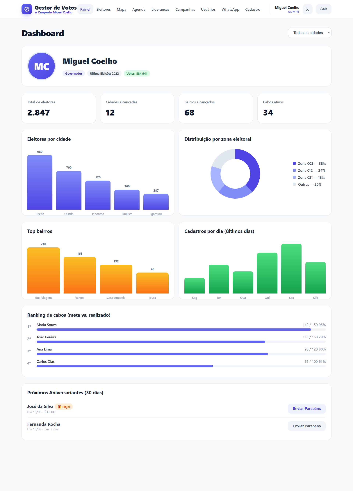

Visão executiva da campanha em uma só tela. Pode ser filtrado por cidade.

- **Perfil da campanha** — foto do candidato, cargo, ano e votos da última eleição.
- **Indicadores (KPIs)** — total de eleitores, cidades e bairros alcançados e cabos ativos.
- **Gráficos** — eleitores por cidade, distribuição por zona eleitoral, top bairros e cadastros por dia.
- **Ranking de cabos** — desempenho de cada liderança como *meta vs. realizado*, com barra de progresso.
- **Próximos aniversariantes (30 dias)** — lista com botão de **Enviar Parabéns** que já abre o WhatsApp com a mensagem pronta.

---

## 3. Eleitores (Planilha)

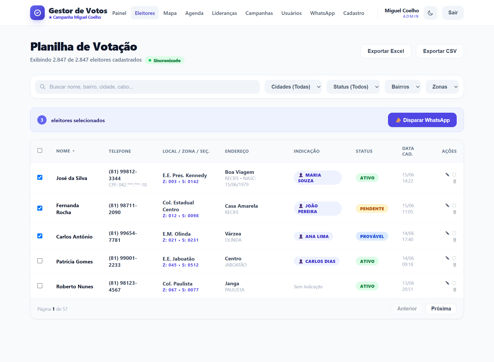

O coração operacional do sistema: a base de eleitores **atualizada em tempo real**
(o selo "Sincronizado" indica a conexão ativa via Socket.io). Cada novo cadastro
aparece para todos instantaneamente.

- **Busca e filtros** — por nome, bairro, cidade ou cabo; e filtros por cidade, status, bairro e zona.
- **Ordenação** — clique no cabeçalho de qualquer coluna.
- **Edição inline** — altere os dados do eleitor direto na linha.
- **Ações por eleitor** — editar, **anonimizar (LGPD)** (apaga dados pessoais mantendo a estatística) e excluir.
- **WhatsApp individual** — botão ao lado do telefone de cada eleitor.
- **Seleção em massa** — marque vários e use **Disparar WhatsApp** para envio coletivo.
- **Exportação** — baixe a lista filtrada em **Excel** ou **CSV**.
- **Paginação** — 50 eleitores por página.

---

## 4. Mapa de Força

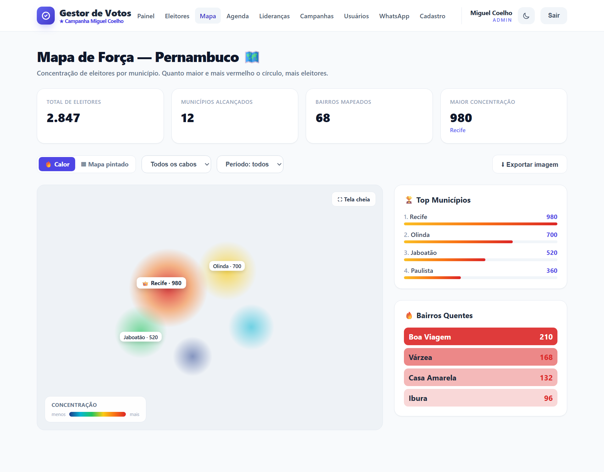

Inteligência geográfica da campanha, focada nos municípios de Pernambuco.

- **Mapa de calor** — quanto mais vermelho e concentrado, mais eleitores na região.
- **Mapa pintado (coroplético)** — alterna para colorir cada município pela quantidade de eleitores.
- **Filtros** — por cabo eleitoral e por período (7, 30, 90 dias ou todos).
- **Indicadores** — total de eleitores, municípios alcançados, bairros mapeados e maior concentração.
- **Top Municípios** e **Bairros Quentes** — rankings laterais; clicar em um município dá *zoom* (drill-down) nele.
- **Exportar imagem** — gera um PNG do mapa para apresentações.

---

## 5. Agenda de Reuniões

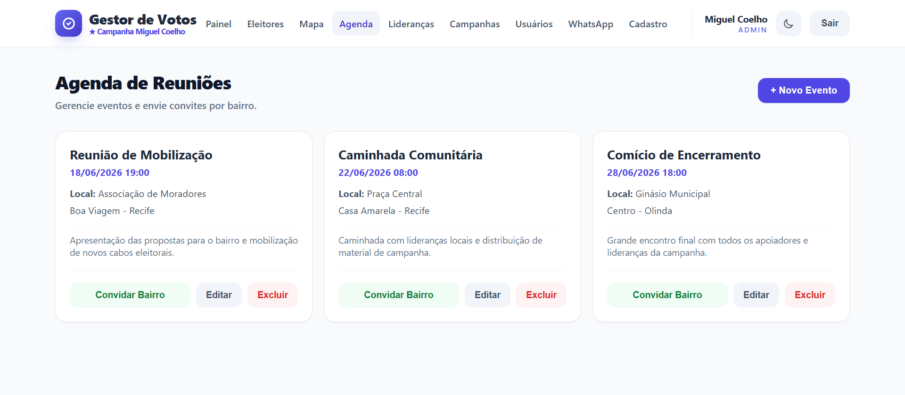

Organização dos compromissos da campanha (reuniões, caminhadas, comícios).

- **Novo evento** — título, data/hora, local, bairro, cidade e descrição.
- **Convidar Bairro** — seleciona automaticamente todos os eleitores do bairro do evento e abre o disparo de convite por WhatsApp.
- **Editar** e **Excluir** cada evento.

---

## 6. Lideranças (Cabos eleitorais)

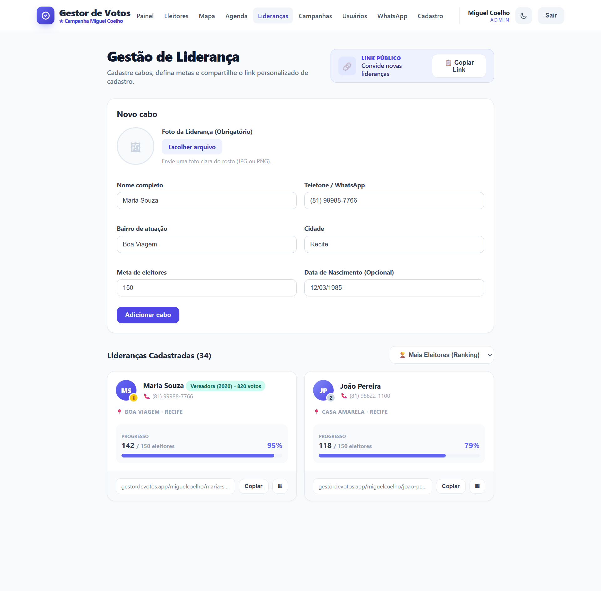

Cadastro e acompanhamento dos cabos eleitorais — os multiplicadores da campanha.

- **Cadastro do cabo** — foto (obrigatória), contato, bairro/cidade de atuação, **meta de eleitores** e histórico político (se já foi candidato).
- **Cartões com ranking** — cada cabo aparece com avatar, medalha de posição (🥇🥈🥉) e barra de **progresso da meta**.
- **Link personalizado** — cada cabo recebe um link amigável (ex.: `…/miguelcoelho/maria-souza`) para captar eleitores; todo cadastro feito por ele já entra vinculado.
- **Copiar link** e **QR Code** — para compartilhar no WhatsApp ou imprimir.
- **Link Público de Lideranças** — botão no topo para convidar novas lideranças a se cadastrarem sozinhas.

---

## 7. Cadastro público de eleitor

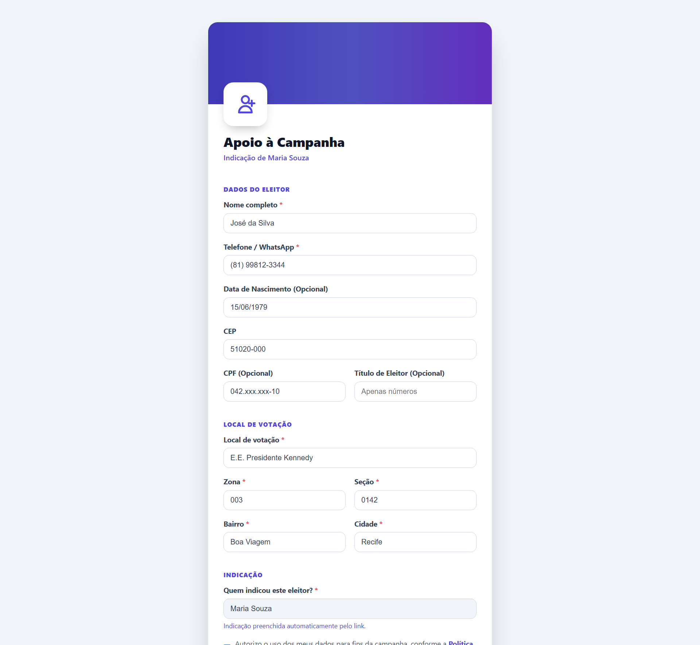

Formulário aberto (sem login) que os cabos compartilham para captar apoiadores.
Otimizado para celular.

- **Dados do eleitor** — nome, telefone/WhatsApp (com máscara), nascimento, CEP (preenche bairro/cidade automaticamente), CPF e título (opcionais).
- **Local de votação** — local, zona, seção, bairro e cidade, com autocompletar.
- **Indicação** — quando aberto pelo link de um cabo, o campo "quem indicou" já vem **preenchido e travado**.
- **Proteções** — validação de campos, rejeição de duplicados, *honeypot* anti-robô e **consentimento LGPD** obrigatório.

---

## 8. Cadastro público de liderança

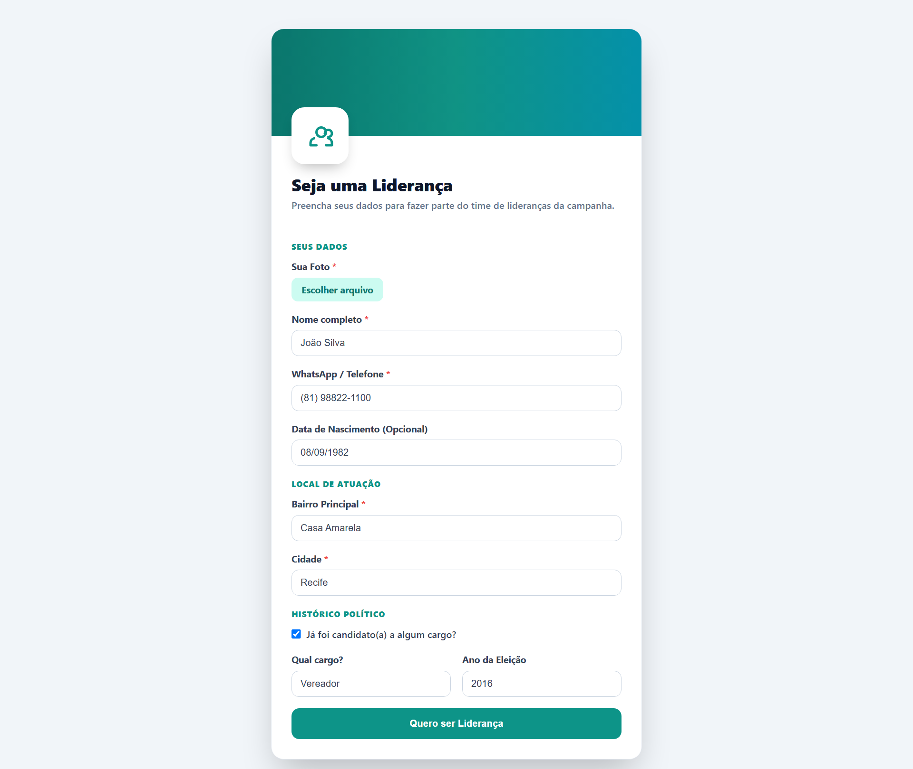

Página pública (tema verde) onde novas lideranças se cadastram sozinhas, sem
precisar de um coordenador.

- **Dados** — foto, nome, WhatsApp, nascimento, bairro/cidade de atuação e histórico político.
- **Link exclusivo na hora** — ao concluir, o sistema gera e exibe o **link de indicação** da nova liderança para ela já começar a captar eleitores.

---

## 9. Campanhas (multi-candidato)

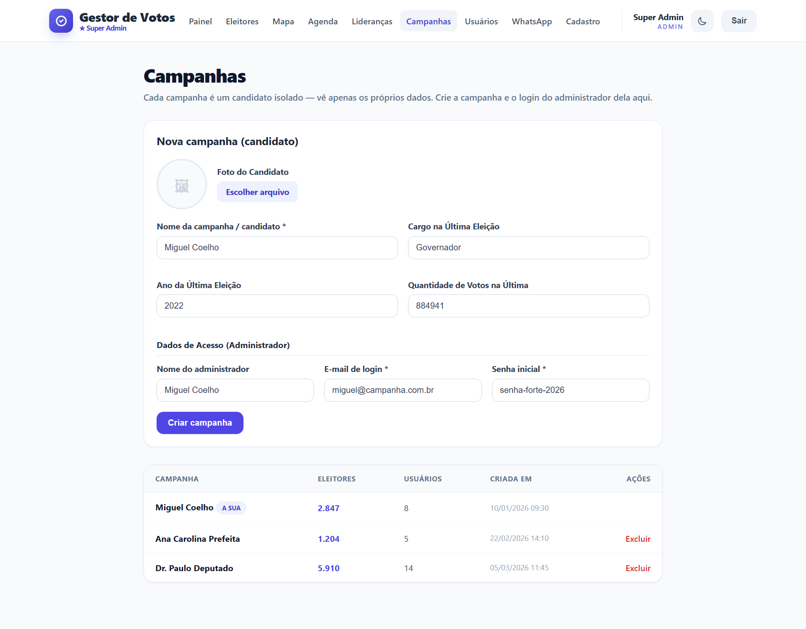

Área do **super administrador**. Cada campanha é um candidato isolado — seus dados
(eleitores, cabos, usuários) ficam totalmente separados dos demais.

- **Nova campanha** — nome/candidato, foto, histórico eleitoral e os **dados de acesso do administrador** daquela campanha (e-mail e senha iniciais).
- **Lista de campanhas** — total de eleitores, de usuários e data de criação de cada uma; a campanha atual é marcada como "a sua".
- **Excluir** — remove a campanha e todos os seus dados (ação permanente).

---

## 10. Usuários

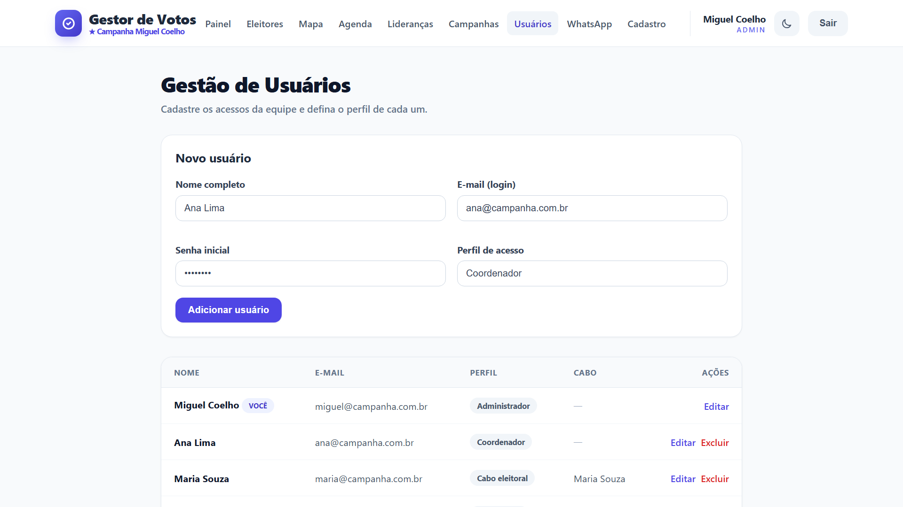

Gestão dos acessos da equipe (exclusivo do administrador da campanha).

- **Novo usuário** — nome, e-mail de login, senha inicial e **perfil de acesso**.
- **Vínculo com cabo** — ao escolher o perfil "Cabo eleitoral", liga-se o usuário a um cabo, de modo que ele veja apenas os próprios eleitores.
- **Editar / Excluir** — gerencie a equipe; o próprio usuário não pode se excluir.

---

## 11. Auditoria (LGPD)

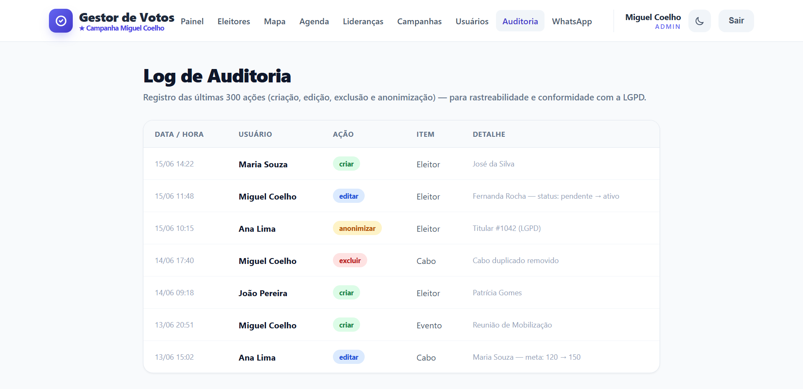

Registro das **últimas 300 ações** do sistema, para rastreabilidade e conformidade
com a LGPD (exclusivo do administrador).

- **Cada linha** mostra data/hora, usuário responsável, ação, item afetado e detalhe.
- **Ações coloridas** — criar (verde), editar (azul), excluir (vermelho) e anonimizar (âmbar).

---

## 12. Central WhatsApp Automático

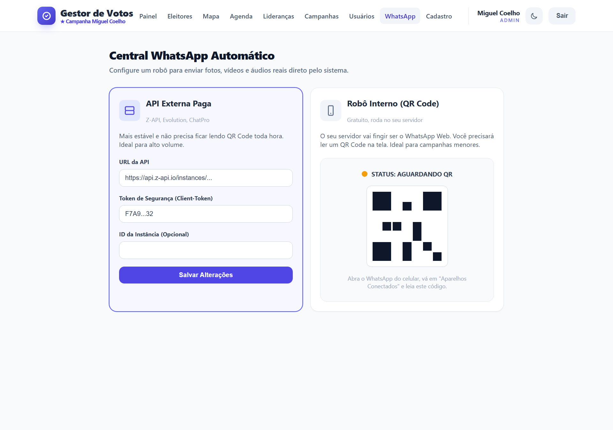

Configuração do robô que envia mensagens reais (texto, fotos, vídeos e áudios)
direto pelo sistema. Há dois modos:

- **API Externa Paga** (Z-API, Evolution, ChatPro) — mais estável e sem ficar lendo QR Code; ideal para alto volume. Configura-se URL, token e ID da instância.
- **Robô Interno (QR Code)** — gratuito, roda no próprio servidor; basta ler o **QR Code** com o WhatsApp do celular (em "Aparelhos Conectados"). Ideal para campanhas menores.

O status da conexão é exibido em tempo real e o WhatsApp automático pode ser
desativado a qualquer momento.

---

> **Tecnologia:** React + TypeScript + Vite + Tailwind (front-end); Node.js +
> Express + Prisma (back-end); PostgreSQL (banco); Socket.io (tempo real); JWT +
> bcrypt (autenticação). Hospedagem: Netlify (front) + Render (API) + Neon (banco).
